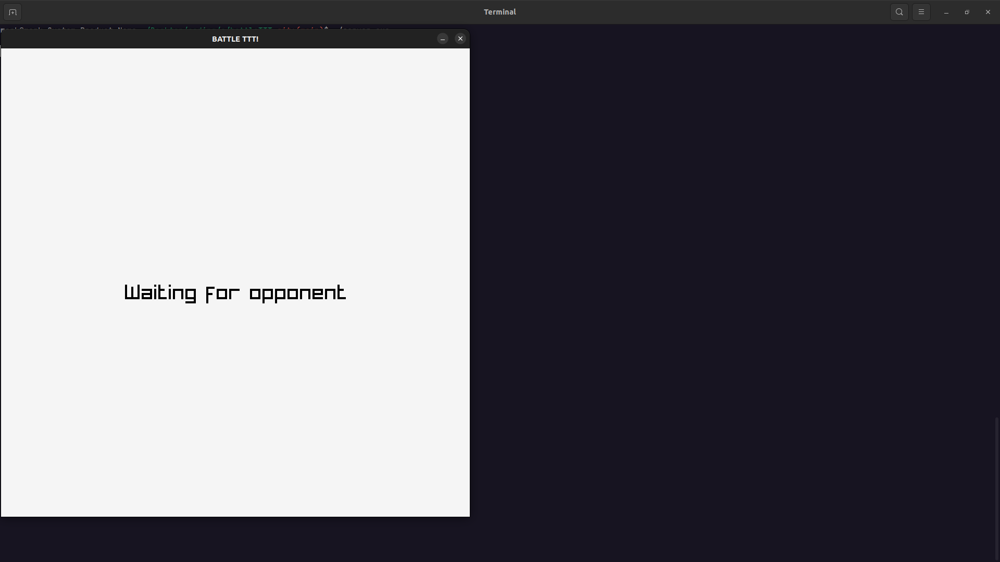
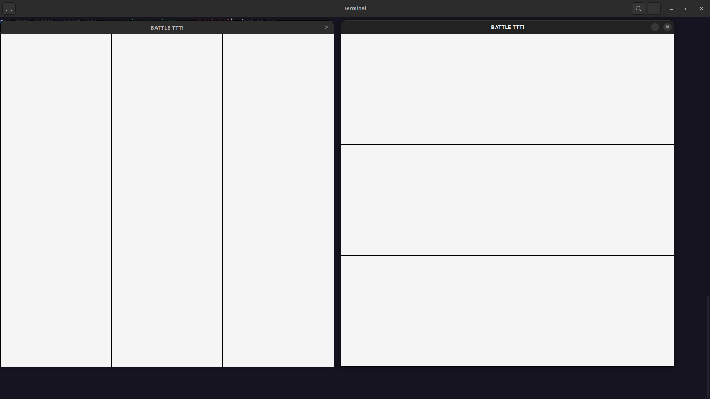
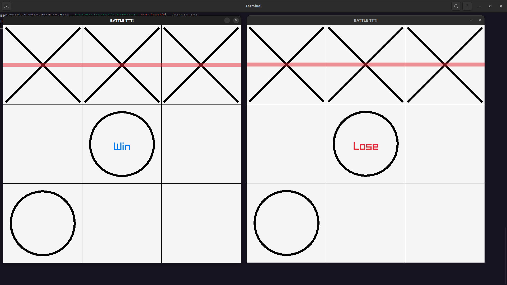

# Online Mulitiplyer Noughts And Crosses

## What I Learned

## DEMO 
### \*\*WATCH IN FULL SCREEN!\*\* (Grid lines do not show properly when not in full screen)
https://github.com/mark2661/Online_Multiplayer_Noughts_And_Crosses/assets/24856744/1f67a90c-7cee-492f-9228-7d02e5030d70
## SCREENSHOTS
*Waiting for an opponent to connect to the server*

  
*Start of match*

  
*End of match*

  
*Opponent disconnect*

  

