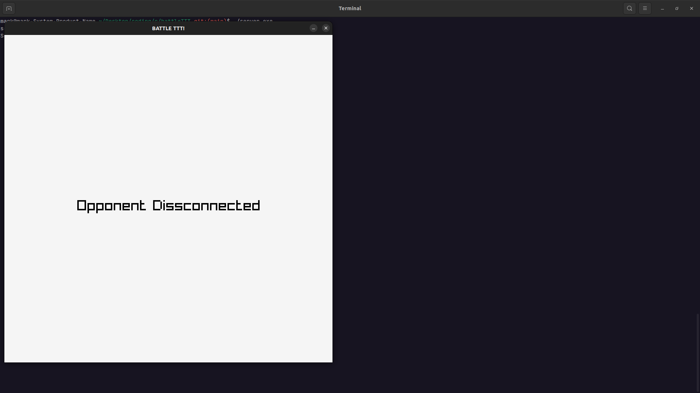

# Online Mulitiplyer Noughts And Crosses
A simple online 2 player noughts and crosses game made in C using [Raylib](https://www.raylib.com/index.html) and the [Unix sockets API](https://man7.org/linux/man-pages/man2/socket.2.html).

## What I Learned
* Creating and managing TCP/IP sockets using the [Unix sockets API](https://man7.org/linux/man-pages/man2/socket.2.html).
* How to create child processes to manage multiple simultaneous connections.
* Serialsing data to send over a network.
* Creating a custom messaging protocol to interpret data sent over the network. 
* Rendering shapes and text using [raylib](https://www.raylib.com/index.html)
## DEMO 
### \*\*WATCH IN FULL SCREEN!\*\* (Grid lines do not show properly when not in full screen)
https://github.com/mark2661/Online_Multiplayer_Noughts_And_Crosses/assets/24856744/1f67a90c-7cee-492f-9228-7d02e5030d70
## SCREENSHOTS
*Waiting for an opponent to connect to the server*

  
*Start of match*

  
*End of match*

  
*Opponent disconnect*

  

